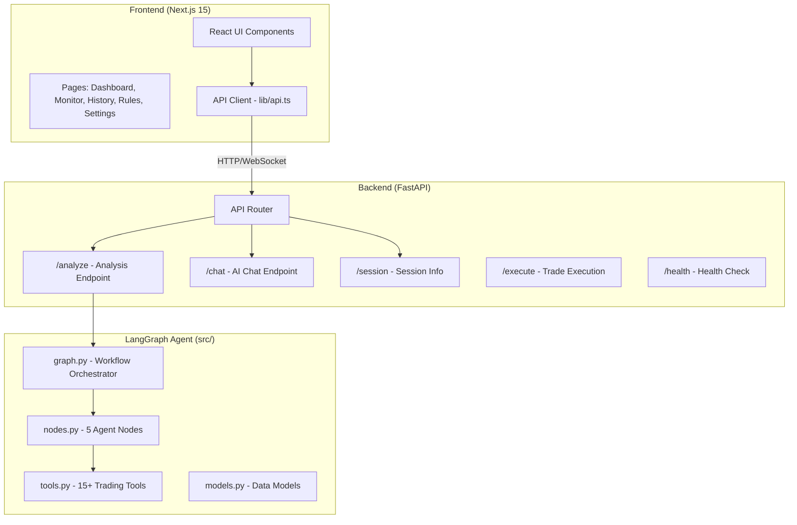
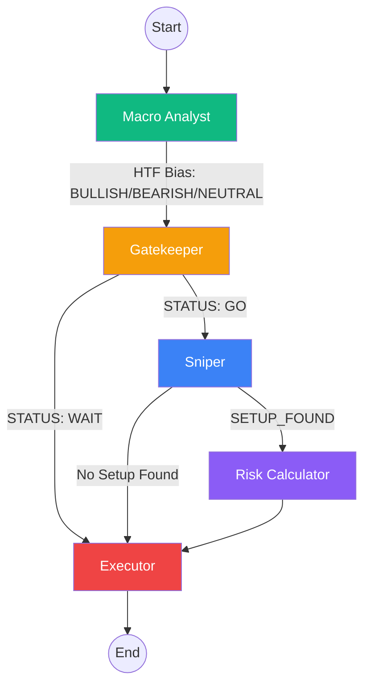
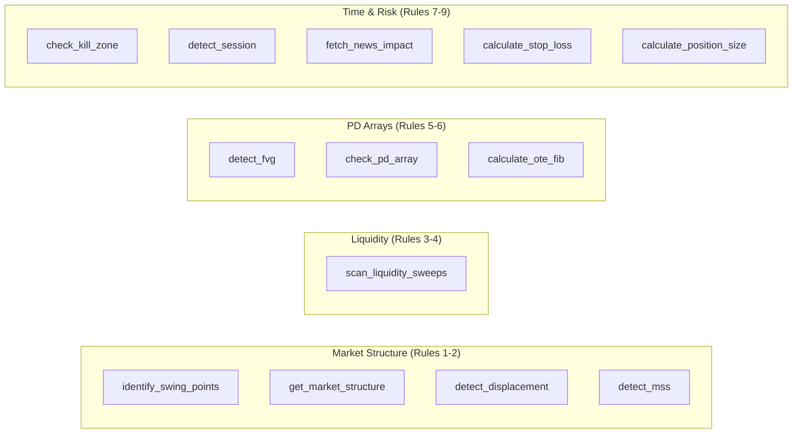
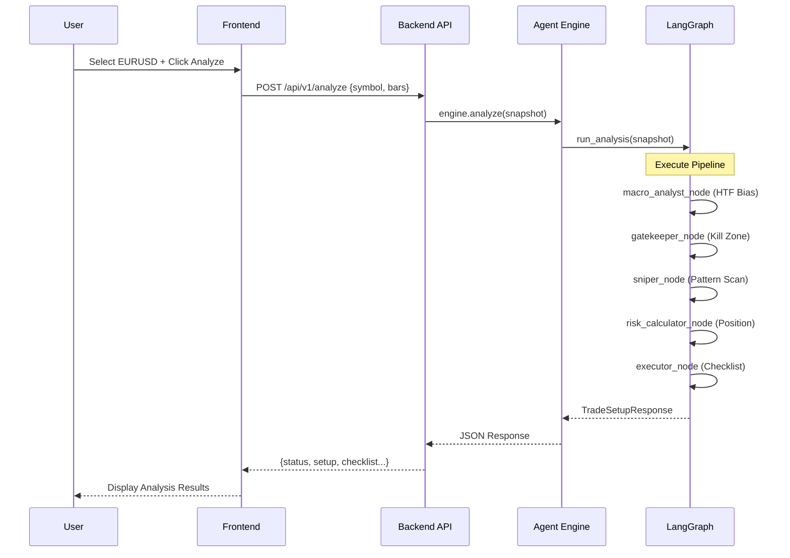
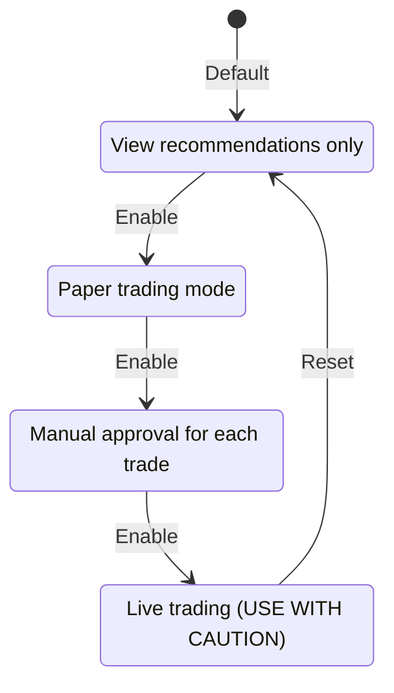

# ICT Agentic Trading System - Complete Documentation

## Overview

The **ICT Agentic Trading System** is a full-stack trading analysis platform that implements Inner Circle Trader (ICT) trading concepts using a LangGraph-based multi-agent architecture. It provides real-time market analysis, trade setup detection, and execution recommendations based on a comprehensive rulebook.

---

## System Architecture



---

## Directory Structure

```
TradeAgenticSystem/
├── backend/                    # FastAPI Backend Server
│   ├── app/
│   │   ├── agent/             # Agent engine wrapper
│   │   │   └── engine.py      # TradingAgentEngine class
│   │   ├── api/v1/            # API Routes
│   │   │   ├── analysis.py    # POST /analyze
│   │   │   ├── chat.py        # POST /chat (AI assistant)
│   │   │   ├── execution.py   # Trade execution & simulation
│   │   │   ├── health.py      # GET /health
│   │   │   ├── session.py     # GET /session/current
│   │   │   └── websocket.py   # WebSocket streaming
│   │   ├── core/              # Core utilities
│   │   │   ├── config.py      # Settings & environment
│   │   │   └── exceptions.py  # Custom exceptions
│   │   ├── domain/            # Domain models
│   │   │   ├── requests.py    # API request schemas
│   │   │   └── responses.py   # API response schemas
│   │   └── main.py            # FastAPI app entry
│   └── requirements.txt
│
├── frontend/                   # Next.js 15 Frontend
│   └── src/
│       ├── app/               # Pages (App Router)
│       │   ├── page.tsx       # Dashboard (/)
│       │   ├── monitor/       # Live Monitor (/monitor)
│       │   ├── history/       # Trade History (/history)
│       │   ├── rules/         # ICT Rules (/rules)
│       │   └── settings/      # Settings (/settings)
│       ├── components/
│       │   ├── analysis/      # TradeSetupViewer, RuleExplanation
│       │   ├── dashboard/     # SessionClock, BiasCard, etc.
│       │   ├── layout/        # Sidebar, Header, ChatPanel
│       │   └── ui/            # shadcn/ui components
│       └── lib/
│           └── api.ts         # API client functions
│
├── src/                        # LangGraph Trading Agent
│   ├── graph.py               # StateGraph workflow
│   ├── nodes.py               # 5 Agent nodes
│   ├── tools.py               # Trading analysis tools
│   └── models.py              # Pydantic models
│
├── rules/                      # ICT Rulebook
│   └── ICT_Rulebook_V1.md     # Complete trading rules
│
└── docs/                       # Design specifications
    ├── BACKEND_DESIGN_SPEC.md
    └── FRONTEND_DESIGN_SPEC.md
```

---

## LangGraph Agent Pipeline

The core trading logic is implemented as a **LangGraph StateGraph** with 5 specialized agent nodes:



### Node Descriptions

| Node | Role | ICT Rules | Input | Output |
|------|------|-----------|-------|--------|
| **Macro Analyst** | Determines 1H directional bias | 1.1, 1.1.1, 1.1.2 | 1H OHLCV data | BIAS: BULLISH/BEARISH/NEUTRAL |
| **Gatekeeper** | Enforces Kill Zones & News rules | 8.1, 8.4, 9.2 | Current time, calendar | STATUS: GO/WAIT |
| **Sniper** | Pattern recognition on LTF | 6.1-6.7 | 15M/5M data + Bias | SETUP with entry details |
| **Risk Calculator** | Position sizing | 7.1, 7.2 | Setup, account balance | Position size, R:R |
| **Executor** | Final checklist & output | 10 | All previous data | TradeSetupResponse |

---

## Trading Tools Reference

The agent uses specialized tools implemented in `src/tools.py`:



### Key Tools

| Tool | Rule | Description |
|------|------|-------------|
| `identify_swing_points` | 2.1 | Fractal-based swing high/low detection |
| `get_market_structure` | 1.1 | Analyzes HH/HL or LH/LL patterns |
| `detect_displacement` | 2.2 | Finds momentum candles (body > ATR × 2) |
| `detect_fvg` | 5.2 | 3-candle Fair Value Gap detection |
| `check_pd_array` | 5.1 | Premium/Discount zone calculation |
| `calculate_ote_fib` | 6.1 | OTE zone (62%-79% retracement) |
| `scan_liquidity_sweeps` | 3.4 | Stop hunt detection |
| `detect_mss` | 2.3 | Market Structure Shift detection |
| `check_kill_zone` | 8.1 | London/NY Kill Zone verification |
| `fetch_news_impact` | 8.4 | High-impact news filter |

---

## API Endpoints

### Analysis API

| Method | Endpoint | Description |
|--------|----------|-------------|
| `POST` | `/api/v1/analyze` | Run trade analysis on snapshot |
| `POST` | `/api/v1/analyze/batch` | Analyze multiple pairs |

### Session & Health

| Method | Endpoint | Description |
|--------|----------|-------------|
| `GET` | `/api/v1/health` | System health & agent status |
| `GET` | `/api/v1/session/current` | Current trading session info |
| `GET` | `/api/v1/killzone/status` | Kill zone active status |

### Execution & Simulation

| Method | Endpoint | Description |
|--------|----------|-------------|
| `GET` | `/api/v1/mode` | Get current execution mode |
| `PUT` | `/api/v1/mode` | Set execution mode |
| `POST` | `/api/v1/execute/simulate` | Create simulated trade |
| `GET` | `/api/v1/trades/simulated` | List simulated trades |

### Chat & Audit

| Method | Endpoint | Description |
|--------|----------|-------------|
| `POST` | `/api/v1/chat` | AI assistant chat |
| `GET` | `/api/v1/audit/decisions` | Decision history |
| `GET` | `/api/v1/audit/metrics` | Performance metrics |

---

## Request/Response Flow



---

## Frontend Pages

### Dashboard (`/`)
- **Session Clock**: Current time, active session, Kill Zone status
- **Bias Cards**: 1H and 15M directional bias
- **Setup Card**: Active trade setup details
- **Confluence Meter**: Setup strength score
- **Execution Checklist**: Pass/fail for all required checks
- **Trading Pair Selector**: Quick pair switching

### Live Monitor (`/monitor`)
- Full analysis view with TradeSetupViewer
- Rule explanation panel
- Real-time session tracking

### History (`/history`)
- Performance metrics (win rate, P&L, profit factor)
- Decision log (approved/rejected setups)
- Simulated trade history

### Rules (`/rules`)
- Complete ICT rulebook reference
- Categorized by: Bias, Structure, Liquidity, PD Arrays, Entry, Risk, Session
- Expandable rule cards with explanations

### Settings (`/settings`)
- Execution mode switcher (Analysis Only → Simulation → Live)
- Risk configuration display

---

## Execution Modes



---

## Data Models

### MarketSnapshot (Input)
```python
{
    "symbol": "EURUSD",
    "timestamp": "2026-01-21T10:00:00Z",
    "timeframe_bars": {
        "1H": [{"open", "high", "low", "close", "volume"}, ...],
        "15M": [...],
        "5M": [...]
    },
    "account_balance": 10000.0,
    "risk_pct": 1.0,
    "economic_calendar": []
}
```

### TradeSetupResponse (Output)
```python
{
    "symbol": "EURUSD",
    "status": "TRADE_NOW" | "WAIT" | "NO_TRADE",
    "htf_bias": {"value": "BULLISH", "rule_refs": ["1.1"]},
    "ltf_alignment": {"alignment": "ALIGNED", "rule_refs": ["1.2"]},
    "setup": {
        "name": "ICT 2022 Model",
        "entry_price": 1.0850,
        "stop_loss": 1.0820,
        "take_profit": [1.0910, 1.0970],
        "confluence_score": 7
    },
    "risk": {"position_size": 0.5, "rr": 2.5},
    "checklist": {
        "htf_bias_exists": true,
        "ltf_mss": true,
        "pd_alignment": true,
        "liquidity_sweep_detected": true,
        "session_ok": true,
        "news_ok": true,
        "rr_minimum_met": true
    },
    "explanation": "Bullish bias confirmed...",
    "confidence": 0.85
}
```

---

## ICT Rules Summary

The system implements rules from the ICT Rulebook organized into categories:

| Category | Rules | Description |
|----------|-------|-------------|
| **Bias** | 1.1, 1.2 | HTF bias (1H) and LTF alignment (15M) |
| **Structure** | 2.1-2.3 | Swing points, displacement, MSS |
| **Liquidity** | 3.1-3.5 | Buy/sell liquidity, stop hunts, equal H/L |
| **PD Arrays** | 5.1-5.4 | Premium/discount, FVG, order blocks |
| **Entry** | 6.1-6.7 | OTE, 2022 model, breaker blocks |
| **Risk** | 7.1-7.5 | 1% risk, 1:2 R:R minimum |
| **Session** | 8.1-8.4 | Kill zones, TGIF, news rules |
| **Discipline** | 9.1-9.3 | Max trades, consecutive losses |
| **Checklist** | 10 | Pre-execution validation |

---

## Running the System

### Backend
```bash
cd backend
pip install -r requirements.txt
uvicorn app.main:app --host 0.0.0.0 --port 8000
```

### Frontend
```bash
cd frontend
npm install
npm run dev
```

### Environment Variables
```env
# backend/.env
GEMINI_API_KEY=your-api-key
EXECUTION_MODE=ANALYSIS_ONLY
DEFAULT_RISK_PCT=1.0
```

---

## Technology Stack

| Layer | Technology |
|-------|------------|
| **Frontend** | Next.js 15, React, TypeScript, TailwindCSS, shadcn/ui |
| **Backend** | FastAPI, Python 3.11+, Pydantic |
| **Agent** | LangGraph, LangChain, Google Gemini |
| **State Management** | React Query (TanStack Query) |
| **Styling** | TailwindCSS, CSS Variables |
