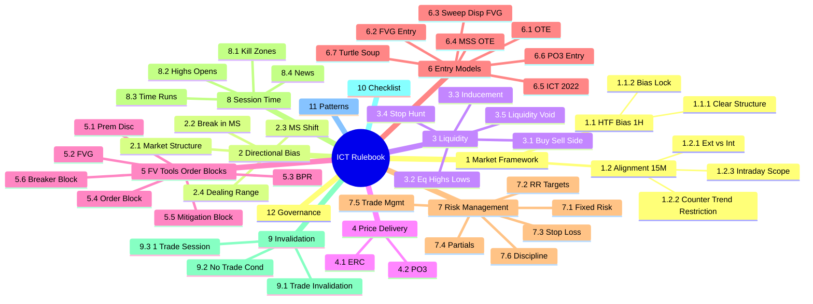

# ICT Rulebook - Visual Map

```mermaid
mindmap
  root((ICT Rulebook))
    1 Market Framework
      1.1 HTF Bias 1H
        1.1.1 Clear Structure
        1.1.2 Bias Lock
      1.2 Alignment 15M
        1.2.1 Ext vs Int
        1.2.2 Counter Trend Restriction
        1.2.3 Intraday Scope
    2 Directional Bias
      2.1 Market Structure
      2.2 Break in MS
      2.3 MS Shift
      2.4 Dealing Range
    3 Liquidity
      3.1 Buy Sell Side
      3.2 Eq Highs Lows
      3.3 Inducement
      3.4 Stop Hunt
      3.5 Liquidity Void
    4 Price Delivery
      4.1 ERC
      4.2 PO3
    5 FV Tools Order Blocks
      5.1 Prem Disc
      5.2 FVG
      5.3 BPR
      5.4 Order Block
      5.5 Mitigation Block
      5.6 Breaker Block
    6 Entry Models
      6.1 OTE
      6.2 FVG Entry
      6.3 Sweep Disp FVG
      6.4 MSS OTE
      6.5 ICT 2022
      6.6 PO3 Entry
      6.7 Turtle Soup
    7 Risk Management
      7.1 Fixed Risk
      7.2 RR Targets
      7.3 Stop Loss
      7.4 Partials
      7.5 Trade Mgmt
      7.6 Discipline
    8 Session Time
      8.1 Kill Zones
      8.2 Highs Opens
      8.3 Time Runs
      8.4 News
    9 Invalidation
      9.1 Trade Invalidation
      9.2 No Trade Cond
      9.3 1 Trade Session
    10 Checklist
    11 Patterns
    12 Governance
```
